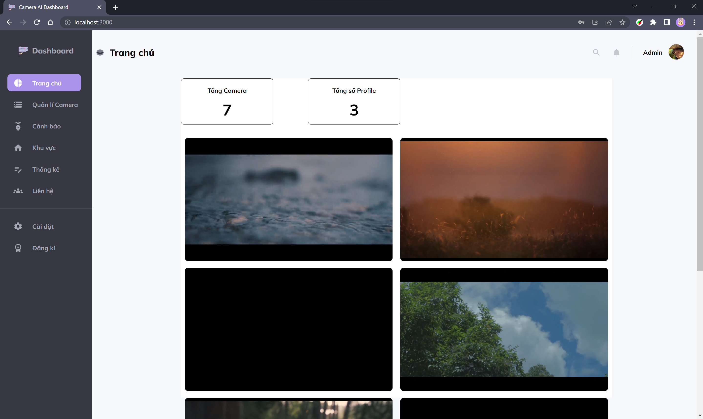
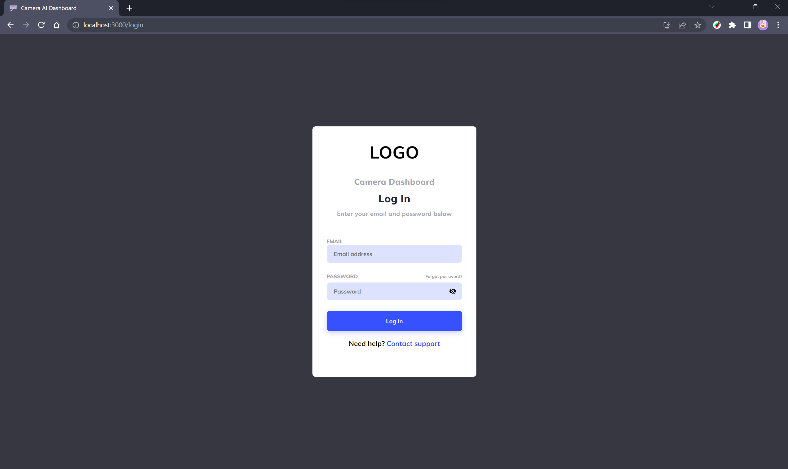
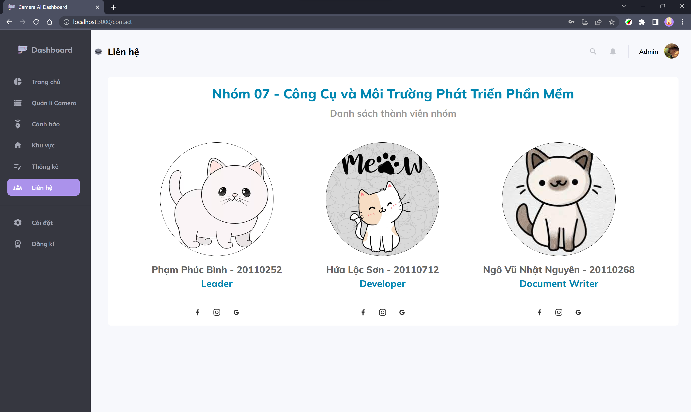

# AI Camera Dashboard




## Table of Contents

- [Introduction](#introduction)
- [Features](#features)
- [Installation with Docker](#installation-with-docker)
- [Installation with npm](#installation-with-npm)
- [Usage](#usage)

---
## Introduction

AI Camera Dashboard là một ứng dụng web được xây dựng bằng React.JS, Back-end RESTs API với Node.JS. Nó cung cấp một giao diện thân thiện với người dùng để quản lý và giám sát các thiết bị Camera AI. Bảng điều khiển này cho phép người dùng thực hiện các hoạt động khác nhau, như xem dữ liệu trực tiếp từ camera, cấu hình camera, cài đặt cảnh báo, xem thông tin khu vực và xem thống kê các cảnh báo theo khu vực hoặc theo thời gian.

---

## Features

- "Real-time" camera feeds
- Camera configuration management
- User authentication and access control
- Dashboard customization options

---
* **Login page.**



* **Home page dashboard for AI Camera.**


* **Contact page.**


---
## Installation with Docker

To run the AI Camera Dashboard locally with Docker, follow these steps:

1. Clone the repository:
    ```bash
    git clone https://github.com/binh0804/AI-Camera-Dashboard.git
    ```
2. Change to the project directory of this project:
    ```bash
    cd AI-Camera-Dashboard/
    ```
3. Install dependencies:
    ```bash
    docker-compose up -d --build
    ```
Open your web browser and visit http://localhost:81 to access the AI Camera Dashboard with Docker.

Alternatively, you can install this project with npm following below tutorial.

## Installation with npm

To run the AI Camera Dashboard locally with npm, follow these steps:

1. Clone the repository:
    ```bash
    git clone https://github.com/binh0804/AI-Camera-Dashboard.git
    ```
2. Change to the project directory:
    ```bash
    cd AI-Camera-Dashboard/client
    ```
3. Install dependencies:
    ```bash
    npm install
    ```
4. To start the development server and launch the dashboard, run the following command:
    ```bash
    npm start
    ```
Open your web browser and visit http://localhost:3000 to access the AI Camera Dashboard.
## Usage
* Login with account Admin :

Email:

```bash
  admin@gmail.com
```
Password:
```bash
  Admin123
```
